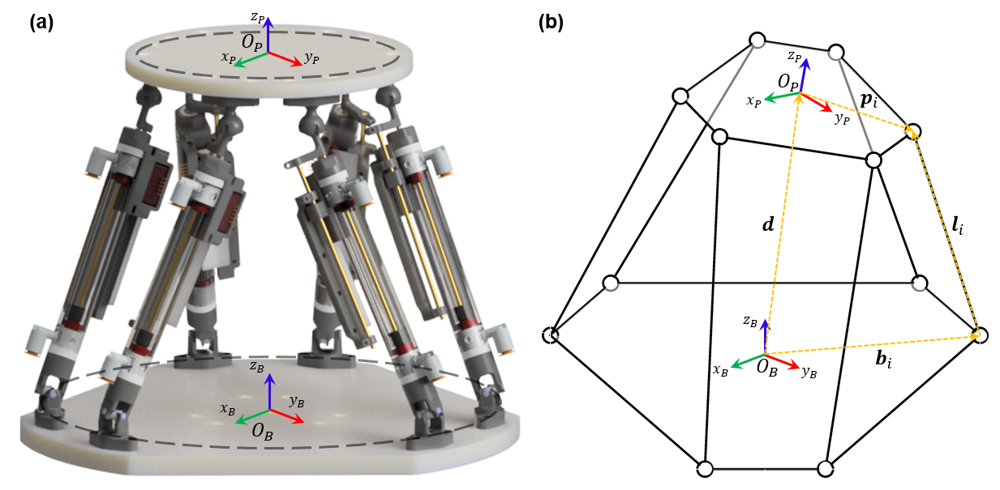

# Parallel-Robot-Kinematics
Inverse and Forward Kinematics of a 6 DOF Parallel Robot

## Introduction
This document describes the kinematics of a 6-DOF (degrees of freedom) parallel robot, designed for MRI-guided interventions, which uses pneumatic actuators to drive its movement. The parallel robot is based on the Stewart-Gough platform, a popular configuration for high-precision applications requiring multiple degrees of freedom.

## Robot Design

### Structure
The robot's structure is composed of three main components:
1. A fixed base.
2. A moving platform.
3. Six identical prismatic limbs.

Each limb is connected to the base via a **universal joint (U)** and to the moving platform via a **spherical joint (S)**, resulting in a 6-UPS configuration. By altering the length of the limbs, the position and orientation of the moving platform are controlled.

### Inverse Kinematics
Inverse kinematics for this robot involve calculating the required lengths of the six limbs to position the moving platform at a desired pose. The fixed base and moving platform are assigned coordinate frames $B$ at point $O_B$ and $P$ at point $O_P$ respectively, with vectors defined for the joint attachment points on both frames.

$$
{}^P\mathbf{p}_{i} = r_P \begin{bmatrix} \cos(\gamma_i) & \sin(\gamma_i) & 0 \end{bmatrix}^T
$$

$$
{}^B\mathbf{b}_{i} = r_B \begin{bmatrix} \cos(\Gamma_i) & \sin(\Gamma_i) & 0 \end{bmatrix}^T
$$

$$
\Gamma_i = \frac{(i-1)\pi}{3} - \alpha_B; \hspace{1mm} \gamma_i = \frac{(i-1)\pi}{3} - \alpha_P, \hspace{1mm}\text{for} \hspace{2mm} i = 1,3,5
$$

$$
\Gamma_i = \Gamma_{i-1} + 2\alpha_B; \hspace{1mm} \gamma_i = \gamma_{i-1} + 2\alpha_P, \hspace{1mm}\text{for} \hspace{2mm} i = 2,4,6
$$

The position vector of the moving platform in the base frame is:

$$
{}^B\mathbf{d} = \begin{bmatrix} x \\ y \\ z \end{bmatrix}
$$

The orientation of the platform is described by three Euler angles: Roll $( \phi )$, Pitch $( \theta )$, and Yaw $( \psi )$. The rotation matrix relating the base frame to the moving platform is expressed as:

$$
{}^BR_{P} = R_z(\psi) R_y(\theta) R_x(\phi)
$$

where $R_z(\psi)$, $R_y(\theta)$, and $R_x(\phi)$ are rotation matrices for each Euler angle.

The length of each limb $l_i$ is calculated as:

$$
l_i = {}^B\mathbf{d} + {}^BR_{P} \cdot {}^P\mathbf{p}_{i} - {}^B\mathbf{b}_{i}
$$

where:
* ${}^B\mathbf{d}$ is the position vector,
* ${}^BR_{P}$ is the rotation matrix,
* ${}^P\mathbf{p}_{i}$ is the position of the passive joint on the platform,
* ${}^B\mathbf{b}_{i}$ is the position of the passive joint on the base.

### Jacobian Matrix
The Jacobian matrix $J$ relates the limb velocities to the twist of the robot's end-effector:

$$\dot{\mathbf{L}} = J \dot{\mathbf{X}}$$

Where:
$$
\dot{\mathbf{L}} = \begin{bmatrix} \dot{l}_1 & \dot{l}_2 & \cdots & \dot{l}_6 \end{bmatrix}^T
$$ 
is the vector of limb velocities,
$$\dot{\mathbf{X}} = \begin{bmatrix} \dot{x} & \dot{y} & \dot{z} & \dot{\phi} & \dot{\theta} & \dot{\psi} \end{bmatrix}^T
$$ 
is the twist of the end-effector.

The Jacobian matrix is a 6x6 matrix derived from the velocity loop closure equations for each limb, capturing the relationships between the robot's limb movements and its platform motion.

$$
J = \begin{bmatrix} 
        \hat{\mathbf{s}}^T_1 & (\mathbf{p}_1 \times \hat{\mathbf{s}}_1^T) \\
        \hat{\mathbf{s}}^T_2 & (\mathbf{p}_2 \times \hat{\mathbf{s}}_2^T) \\
        \vdots & \vdots \\
        \hat{\mathbf{s}}^T_6 & (\mathbf{p}_6 \times \hat{\mathbf{x}}_6^T) \\
    \end{bmatrix}
$$

### Forward Kinematics
Forward kinematics determine the platform's pose (position and orientation) given the current lengths of the six limbs. However, the forward kinematics problem for this parallel robot is non-trivial, with no closed-form solutions due to the highly non-linear equations involved.

The **Newton-Raphson** iterative method is employed to solve the forward kinematics, where an initial guess for the platform pose is iteratively updated until the limb length errors converge.

Given the desired limb lengths $l_i$, the objective is to calculate the estimated lengths $l_i^*$ through an iterative process given an initial pose estimate $\mathbf{X}_{j-1}$. The estimated limb lengths $l_i^*$ are solved for using the inverse kinematics, and the value of $\mathbf{X}_{j-1}$ is incremented by a small step-size until the value of $\mathbf{X}_j$, which minimizes the scalar function:

$$
f_i(\mathbf{X}) = l_i - l_i^*
$$

## Conclusion
The parallel robot described here features a robust kinematic design, capable of achieving accurate 6-DOF motion within the MRI environment. Its Stewart-Gough platform structure allows for precise control of the platform's position and orientation through the manipulation of six prismatic actuators, guided by inverse kinematics and Jacobian-based control methods.

## References

[1] Musa, M., Sengupta, S., & Chen, Y. (2022). Design of a 6-DoF parallel robotic platform for MRI applications. Journal of Medical Robotics Research, 7(02n03), 2241005.

[2] Musa, M., Sengupta, S., & Chen, Y. (2021, November). Design of a 6 dof parallel robot for mri-guided interventions. In 2021 International Symposium on Medical Robotics (ISMR) (pp. 1-7). IEEE.

[3] Taghirad, H. D. (2013). Parallel robots: mechanics and control. CRC press.